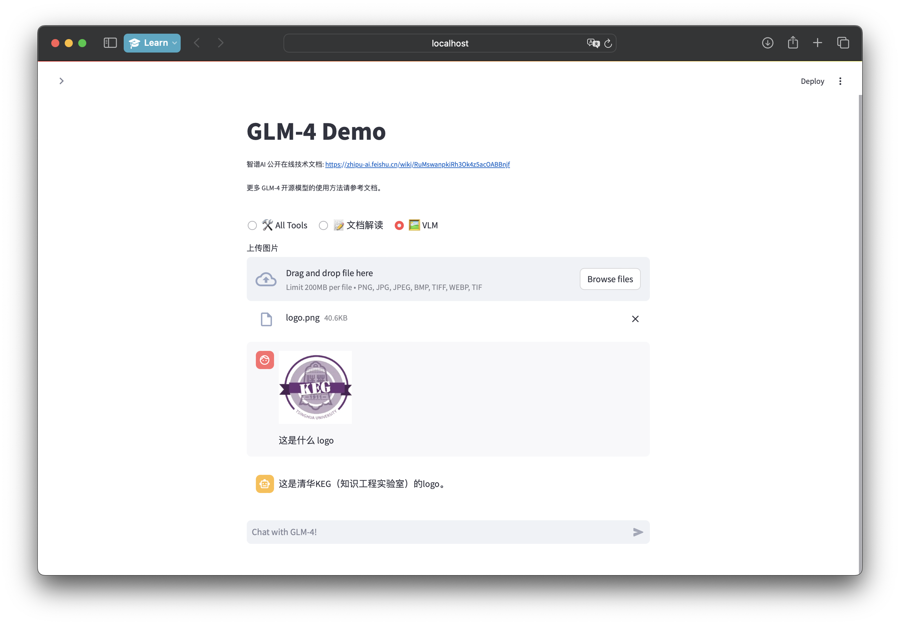

# GLM-4-9B Web Demo



## Installation

We recommend using [Conda](https://docs.conda.io/en/latest/) for environment management.

Execute the following commands to create a conda environment and install the required dependencies:

```bash
conda create -n glm-4-demo python=3.12
conda activate glm-4-demo
pip install -r requirements.txt
```

Please note that this project requires Python 3.10 or higher.
In addition, you need to install the Jupyter kernel to use the Code Interpreter:

```bash
ipython kernel install --name glm-4-demo --user
```

You can modify `~/.local/share/jupyter/kernels/glm-4-demo/kernel.json` to change the configuration of the Jupyter
kernel, including the kernel startup parameters. For example, if you want to use Matplotlib to draw when using the
Python code execution capability of All Tools, you can add `"--matplotlib=inline"` to the `argv` array.

To use the browser and search functions, you also need to start the browser backend. First, install Node.js according to
the instructions on the [Node.js](https://nodejs.org/en/download/package-manager)
official website, then install the package manager [PNPM](https://pnpm.io) and then install the browser service
dependencies:

```bash
cd browser
npm install -g pnpm
pnpm install
```

## Run

1. Modify `BING_SEARCH_API_KEY` in `browser/src/config.ts` to configure the Bing Search API Key that the browser service
   needs to use:

```diff
--- a/browser/src/config.ts
+++ b/browser/src/config.ts
@@ -3,7 +3,7 @@ export default {

BROWSER_TIMEOUT: 10000,
BING_SEARCH_API_URL: 'https://api.bing.microsoft.com/v7.0',
- BING_SEARCH_API_KEY: '',
+ BING_SEARCH_API_KEY: '<PUT_YOUR_BING_SEARCH_KEY_HERE>',

HOST: 'localhost',
PORT: 3000,
```

2. The Wenshengtu function needs to call the CogView API. Modify `src/tools/config.py`
   , provide the [Zhipu AI Open Platform](https://open.bigmodel.cn) API Key required for the Wenshengtu function:

```diff
--- a/src/tools/config.py
+++ b/src/tools/config.py
@@ -2,5 +2,5 @@ BROWSER_SERVER_URL = 'http://localhost:3000'

IPYKERNEL = 'glm4-demo'

-ZHIPU_AI_KEY = ''
+ZHIPU_AI_KEY = '<PUT_YOUR_ZHIPU_AI_KEY_HERE>'
COGVIEW_MODEL = 'cogview-3'
```

3. Start the browser backend in a separate shell:

```bash
cd browser
pnpm start
```

4. Run the following commands to load the model locally and start the demo:

```bash
streamlit run src/main.py
```

Then you can see the demo address from the command line and click it to access it. The first access requires downloading
and loading the model, which may take some time.

If you have downloaded the model locally, you can specify to load the model from the local
by `export *_MODEL_PATH=/path/to/model`. The models that can be specified include:

- `CHAT_MODEL_PATH`: used for All Tools mode and document interpretation mode, the default is `THUDM/glm-4-9b-chat`.

- `VLM_MODEL_PATH`: used for VLM mode, the default is `THUDM/glm-4v-9b`.

The Chat model supports reasoning using [vLLM](https://github.com/vllm-project/vllm). To use it, please install vLLM and
set the environment variable `USE_VLLM=1`.

If you need to customize the Jupyter kernel, you can specify it by `export IPYKERNEL=<kernel_name>`.

## Usage

GLM4 Demo has three modes:

- All Tools mode
- VLM mode
- Text interpretation mode

### All Tools mode

You can enhance the model's capabilities by registering new tools in `tool_registry.py`. Just use `@register_tool`
decorated function to complete the registration. For tool declarations, the function name is the name of the tool, and
the function docstring
is the description of the tool; for tool parameters, use `Annotated[typ: type, description: str, required: bool]` to
annotate the parameter type, description, and whether it is required.

For example, the registration of the `get_weather` tool is as follows:

```python
@register_tool
def get_weather(
        city_name: Annotated[str, 'The name of the city to be queried', True],
) -> str:


    """
    Get the weather for `city_name` in the following week
    """
...
```

This mode is compatible with the tool registration process of ChatGLM3-6B.

+ Code capability, drawing capability, and networking capability have been automatically integrated. Users only need to
  configure the corresponding Key as required.
+ System prompt words are not supported in this mode. The model will automatically build prompt words.

## Text interpretation mode

Users can upload documents and use the long text capability of GLM-4-9B to understand the text. It can parse pptx, docx,
pdf and other files.

+ Tool calls and system prompt words are not supported in this mode.
+ If the text is very long, the model may require a high amount of video memory. Please confirm your hardware
  configuration.

## Image Understanding Mode

Users can upload images and use the image understanding capabilities of GLM-4-9B to understand the images.

+ This mode must use the glm-4v-9b model.
+ Tool calls and system prompts are not supported in this mode.
+ The model can only understand and communicate with one image. If you need to change the image, you need to open a new
  conversation.
+ The supported image resolution is 1120 x 1120
